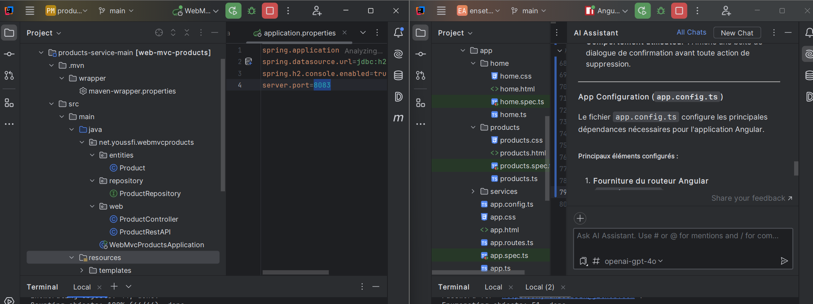
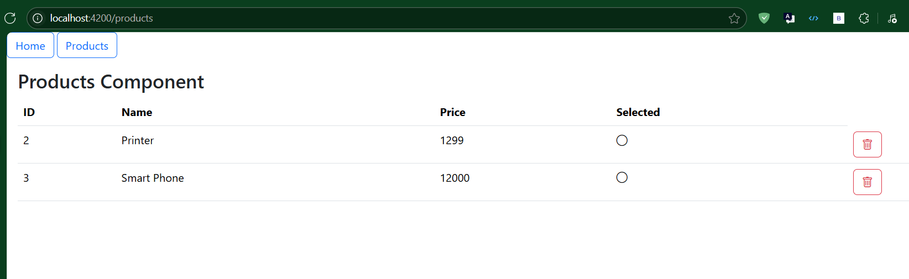
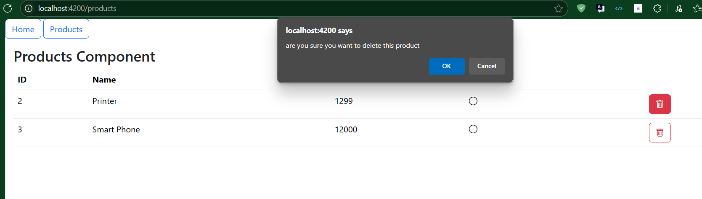
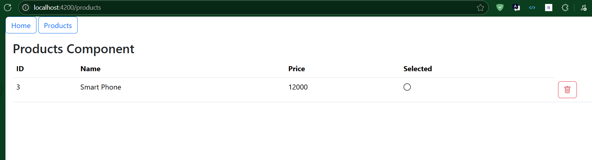

# EnsetApp

Ce projet a été généré avec [Angular CLI](https://github.com/angular/angular-cli) version 20.0.0.

## Serveur de développement

Pour démarrer un serveur de développement local, exécutez :

```bash
ng serve
```

Une fois le serveur lancé, ouvrez votre navigateur et accédez à `http://localhost:4200/`. L’application se rechargera automatiquement lorsque vous modifiez les fichiers sources.

## Génération de code

Angular CLI inclut des outils de génération de code puissants. Pour générer un nouveau composant, utilisez :

```bash
ng generate component nom-du-composant
```

Pour voir la liste complète des schémas disponibles (`components`, `directives`, `pipes`, etc.), exécutez :

```bash
ng generate --help
```

## Compilation

Pour compiler le projet, lancez :

```bash
ng build
```

Cela va compiler le projet et stocker les artefacts de build dans le répertoire `dist/`. Par défaut, la compilation en mode production optimise les performances et la rapidité de l’application.

## Exécution des tests unitaires

Pour exécuter les tests unitaires avec le framework [Karma](https://karma-runner.github.io), utilisez :

```bash
ng test
```

## Exécution des tests end-to-end

Pour effectuer des tests end-to-end (e2e), exécutez :

```bash
ng e2e
```

Angular CLI ne fournit pas de framework de test end-to-end par défaut. Vous pouvez choisir celui qui correspond le mieux à vos besoins.

## Ressources supplémentaires

Pour plus d’informations sur l’utilisation de l’Angular CLI et les références complètes des commandes, visitez la page [Angular CLI Overview and Command Reference](https://angular.dev/tools/cli).

## Description des composants principaux

### Composant Products

Le composant `Products` est conçu pour la gestion des produits dans l'application. Voici ses principales fonctionnalités :

- **Affichage des produits** : Il récupère une liste de produits via un service Angular et les affiche dans l’interface utilisateur.
- **Suppression de produits** : Il permet de supprimer un produit après confirmation de l’utilisateur. Une fois supprimé, la liste des produits est automatiquement mise à jour.
- **Cycle de vie Angular** : Il utilise `ngOnInit` pour récupérer les produits lors de l’initialisation.
- **Service de données** : Il interagit avec la classe/service `Product` pour gérer les données des produits.

### Configuration de l'application avec `app.config.ts`

Le fichier `app.config.ts` configure les services et fonctionnalités globales de l'application. Il gère :

- **Les routes de l’application** : Configuration via `provideRouter`.
- **La gestion des erreurs globales** : Interception et gestion des erreurs.
- **Le client HTTP d'Angular** : Intégration pour effectuer des requêtes HTTP vers les APIs.
- **Optimisation des performances** : Activation des changements zonés avec `eventCoalescing`.

### Demarrage App Backend  and front 

### interface front-end

### suppresion d'un produit 


